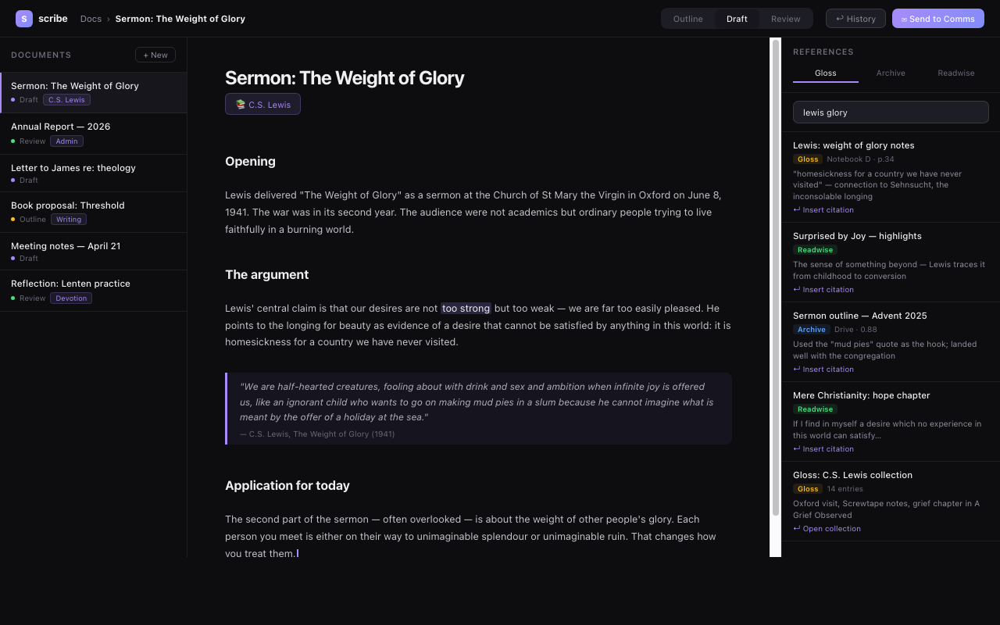

# Scribe

Scribe is a writing tool built around your personal knowledge. Start a document and Scribe automatically pulls in relevant notes from your journal ([Gloss](https://github.com/nathan0colestock-code/gloss)), highlighted passages from your reading (Readwise), and matching archived files ([Black Hole](https://github.com/nathan0colestock-code/black)) — all in a side panel while you write. When a draft is ready, hand it to [Comms](https://github.com/nathan0colestock-code/comms) and it drafts the outbound email in your voice, tailored to the recipient's history with you.

Part of a five-app personal suite: [maestro](https://github.com/nathan0colestock-code/maestro) · [gloss](https://github.com/nathan0colestock-code/gloss) · [comms](https://github.com/nathan0colestock-code/comms) · [black hole](https://github.com/nathan0colestock-code/black)



---

## Surfaces

- **Home** — all documents, each tagged by its linked Gloss collection and current stage
- **Editor** — block-based editor with drag handles, style guide, and the reference side panel
- **Collections** — documents grouped under their Gloss collections

---

## Features

### Three stages per document
**Outline → Draft → Review.** Each stage has its own Yjs-backed editor. Stage transitions auto-snapshot into `document_snapshots` so "what did the outline look like?" is always answerable.

### Reference panel
Three live sources in the sidebar:
- **Gloss** — collections, people, scripture, books, artifacts matching the doc's topic
- **Archive** — top hits from [Black Hole](https://github.com/nathan0colestock-code/black) (cached 5 min)
- **Readwise** — searchable highlights + source books from your Readwise account

Click any item to insert a citation-style blockquote at the cursor.

### AI writing assistance
- **Proofread** — inline grammar and clarity pass via Gemini
- **Style check** — tone, register, and consistency review

### Outline system
Structured outline nodes with full CRUD and card creation. **Materialize** explodes an outline into a seeded draft fragment with one click.

### Paste-import
"Import text…" next to "New document". Paste a reMarkable export or any plain text, confirm the title, and the doc opens in Draft with the text seeded.

### Send to Comms
On a review-stage document, hand off the plaintext to [Comms](https://github.com/nathan0colestock-code/comms). Comms generates a Gmail draft in your voice using the recipient's message history and gloss notes. Nothing sends automatically.

### Real-time collaboration
Yjs-backed sync via a Hocuspocus WebSocket server. Multi-role share links (editor / viewer / commenter). Guest access with display-name-based identity — no account required.

Corruption safety: Yjs updates are try/catch-wrapped. A bad buffer can't brick a doc; the corrupt state is preserved as a `corruption_fallback` snapshot.

### Readwise integration
`POST /api/readwise/sync` pulls updated highlights and books from Readwise. The reference panel searches them live as you write. `GET /api/documents/:id/readwise-suggestions` surfaces the most relevant highlights for the current document topic.

---

## Stack

- Node 20 + Express API
- Vite + React frontend (`src/`)
- SQLite (`better-sqlite3`)
- Hocuspocus for real-time Yjs collaboration
- Deployed to [Fly.io](https://fly.io)
- SQLite replicated to Cloudflare R2 via [Litestream](https://litestream.io)

---

## Quick start

```bash
npm install
cp .env.example .env              # API_KEY, GLOSS_URL, GLOSS_API_KEY
npm run dev                        # API on :3748, Vite on :5173
npm test
```

---

## API

All routes require `Authorization: Bearer <API_KEY>` or `Bearer <SUITE_API_KEY>`.

### Documents
- `GET /api/health` — liveness, no auth
- `GET /api/status` — suite-standard status envelope
- `GET /api/documents` — list + search
- `POST /api/documents` — create; accepts `seed_body` for server-seeded drafts (e.g. from Black Hole's "Open in Scribe")
- `GET /api/documents/:id/pending-seed` — read-once drain of server-provided seed text
- `GET /api/documents/:id/collaborators` — list active collaborators
- `GET /api/documents/:id/collab-token` — WebSocket auth token
- `POST /api/documents/:id/send-to-comms` — hand off to Comms for Gmail drafting
- `POST /api/documents/:id/materialize` — explode outline into a draft fragment

### AI
- `POST /api/documents/:id/ai/proofread` — grammar and clarity pass
- `POST /api/documents/:id/ai/style-check` — tone and register review

### Outline
- `GET/POST/PATCH/DELETE /api/documents/:id/outline/*` — outline node CRUD

### Sharing & collaboration
- `POST /api/documents/:id/share` — create a share link with a role (editor/viewer/commenter)
- `GET /api/documents/:id/shares` — list active shares
- `DELETE /api/documents/:id/shares/:token` — revoke
- `POST /api/join` — guest access with display name

### Gloss
- `GET /api/gloss-links/collections` — linked Gloss collections

### Black Hole
- `GET /api/documents/:id/black-suggestions` — archive hits for the doc's topic (cached 5 min)

### Readwise
- `POST /api/readwise/sync` — pull highlights + books (`READWISE_TOKEN` required)
- `GET /api/readwise/search?q=...` — fuzzy search across highlights, notes, and titles
- `GET /api/readwise/books` / `GET /api/readwise/books/:id/highlights`
- `GET /api/readwise/recent` / `GET /api/readwise/state`
- `GET /api/documents/:id/readwise-suggestions` — highlights relevant to this document

---

## Deploy

```bash
fly deploy
```

Fly secrets: `API_KEY`, `SUITE_API_KEY`, `GLOSS_URL`, `GLOSS_API_KEY`, `SESSION_SECRET`, `AUTH_PASSWORD`, `R2_ACCESS_KEY_ID`, `R2_SECRET_ACCESS_KEY`, `R2_ENDPOINT`.

---

## Suite siblings

Scribe is the **longform writing** node of a five-app personal suite. Independent processes, all on [Fly.io](https://fly.io), backed up to R2 via Litestream.

| App | What it does | How it connects to Scribe |
|---|---|---|
| **[gloss](https://github.com/nathan0colestock-code/gloss)** | Personal knowledge graph (journal OCR, pages, collections, people) | "Promote to Scribe" creates docs from gloss pages; documents tagged by gloss collection |
| **[comms](https://github.com/nathan0colestock-code/comms)** | iMessage + Gmail + contacts hub | "Send to Comms" hands a review-stage doc for Gmail drafting |
| **[black hole](https://github.com/nathan0colestock-code/black)** | Personal file search (Drive, Evernote, iCloud) | Archive suggestions in the reference panel; "Open in Scribe" seeds a doc from any search result |
| **[maestro](https://github.com/nathan0colestock-code/maestro)** | Overnight code orchestration | Polls `/api/status`; dispatches feature sets |

All five apps expose `GET /api/status` → `{ app, version, ok, uptime_seconds, metrics }`, Bearer-authed.

Integration contracts live in `docs/INTEGRATIONS/` in the primary repo for each contract.

---

## License

Private.

---

## Have Claude help you set this up

Paste this into [Claude](https://claude.ai) to get guided setup assistance:

> I want to set up Scribe from https://github.com/nathan0colestock-code/scribe. It's a block-based document editor that connects to Gloss and Readwise. Help me get the server running and create my first document. I'll share my `.env.example` and any errors as we go.
